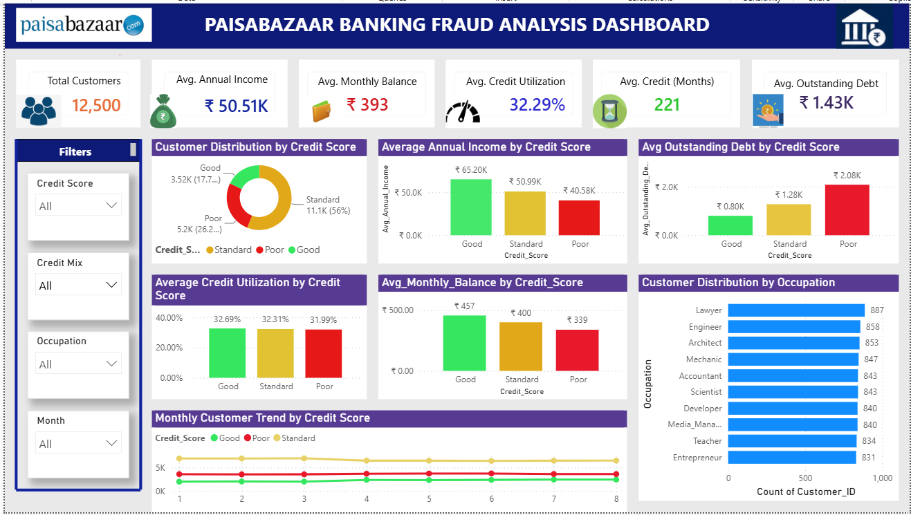

# 📊 Paisabazaar Banking Customer Analysis Dashboard

An end-to-end **Business Intelligence Dashboard** built using **Microsoft Power BI** to analyze customer financial behavior, credit profiles, income patterns, outstanding debt, and key banking KPIs.

---

**📷 Dashboard Preview**

---

**📌 Project Summary**

This project presents an interactive **Banking Customer Analysis Dashboard** developed using **Microsoft Power BI** to provide meaningful insights into customer financial health and credit behavior.

By analyzing key financial metrics such as **Annual Income, Monthly Balance, Outstanding Debt, Credit Utilization, Credit History, and Credit Score**, the dashboard enables stakeholders to compare customer segments, monitor financial trends, and evaluate overall banking performance.

Built using **Power Query** and **DAX**, the dashboard offers dynamic filtering, KPI tracking, and interactive visualizations that simplify complex financial data into actionable business insights.

---

**⭐ Key Highlights**

- Built an interactive Power BI dashboard using 100,000 banking records.
- Analyzed financial behavior across 12,500 unique customers.
- Designed KPI cards for key banking metrics.
- Created interactive charts and visualizations.
- Developed custom DAX measures.
- Performed data cleaning using Power Query.
- Implemented dynamic slicers and filters.
- Delivered actionable business insights.

---

**📊 Dashboard Features**

- 👥 Total Customers
- 💰 Average Annual Income
- 💳 Average Monthly Balance
- 💸 Average Outstanding Debt
- 📈 Credit Utilization
- 📅 Credit History
- 📊 Credit Score Distribution
- 💼 Occupation Analysis
- 📈 Monthly Trends
- 🎛️ Interactive Slicers

---

**🎯 Business Impact**

The dashboard helps financial institutions understand customer financial behavior, monitor key banking KPIs, identify trends, and support better business decisions through interactive reporting.

---

**🛠️ Tech Stack**

- Microsoft Power BI
- Power Query
- DAX
- Microsoft Excel
- Data Visualization
- Business Intelligence

---

**🚀 Skills Demonstrated**

- Power BI Dashboard Development
- Data Modeling
- DAX
- Power Query
- KPI Design
- Data Visualization
- Business Intelligence
- Financial Analytics
- Interactive Reporting
- Data Storytelling

---

**👨‍💻 Author**

**Vijay Kumar Edukula**

Aspiring Data Analyst | Power BI | SQL | Python

GitHub: https://github.com/vijayca444-alt

---

⭐ If you found this project useful, consider giving it a Star!
